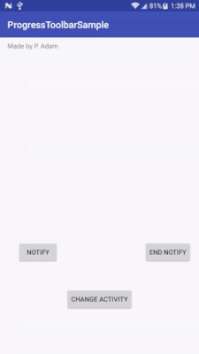

# ProgressToolbar

Display persistent loading messages in your Toolbars.  
Messages will withstand activity lifecycle changes and be shown across all registered activities.




## Usage:

#### Initialize in your Application class:
```kotlin
class App : Application() {
    override fun onCreate() {
        super.onCreate()
        ProgressToolbar.init(this)
    }
}
```

#### Register your activity:
```kotlin
class MainActivity : AppCompatActivity() {

    override fun onCreate(savedInstanceState: Bundle?) {
        super.onCreate(savedInstanceState)
        setContentView(R.layout.activity_main) // The activity must contain a Toolbar. 
        setSupportActionBar(toolbar)
        ProgressToolbar.register(this) // Or use the registerForNotifications() extension function.
    }
}
```

#### Display message:
```kotlin
ProgressToolbar.notify("Loading something.")
```

#### Hide message:
```kotlin
ProgressToolbar.endNotification() 
```

#### Unregister when done:
```kotlin
override fun onDestroy() {
    super.onDestroy()
    ProgressToolbar.unregister(this)
}
```


Download
--------

```groovy
dependencies {
    implementation 'gr.sieben:progresstoolbar:1.1.1'
}
```

License
-------
    Copyright 2018 SiEBEN Ltd

    Licensed under the Apache License, Version 2.0 (the "License");
    you may not use this file except in compliance with the License.
    You may obtain a copy of the License at

       http://www.apache.org/licenses/LICENSE-2.0

    Unless required by applicable law or agreed to in writing, software
    distributed under the License is distributed on an "AS IS" BASIS,
    WITHOUT WARRANTIES OR CONDITIONS OF ANY KIND, either express or implied.
    See the License for the specific language governing permissions and
    limitations under the License.
